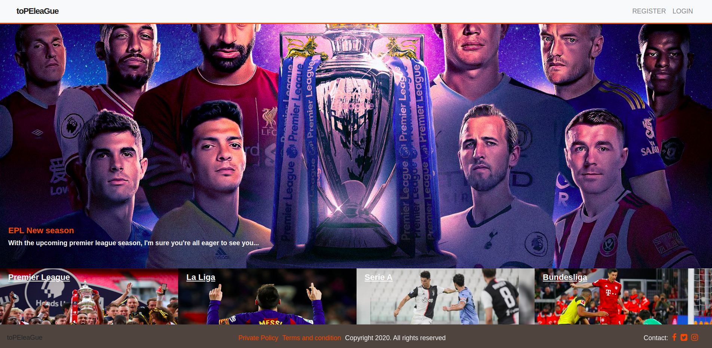
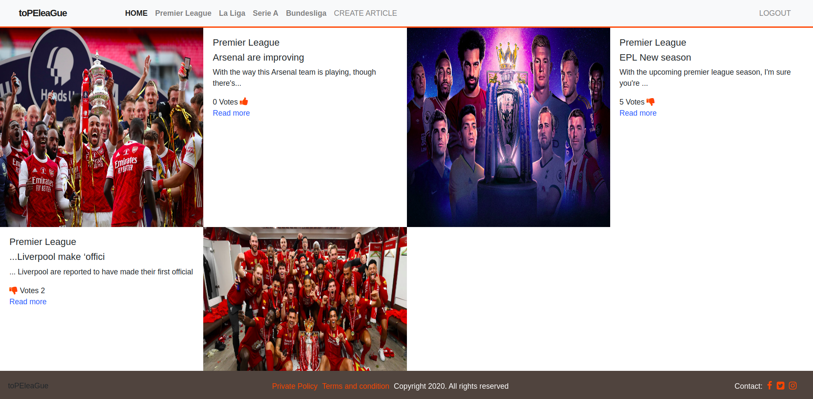
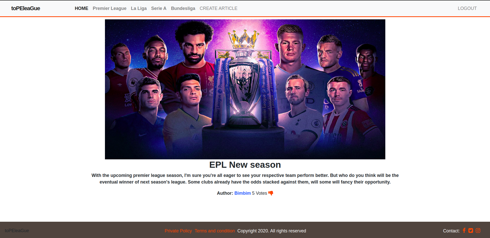
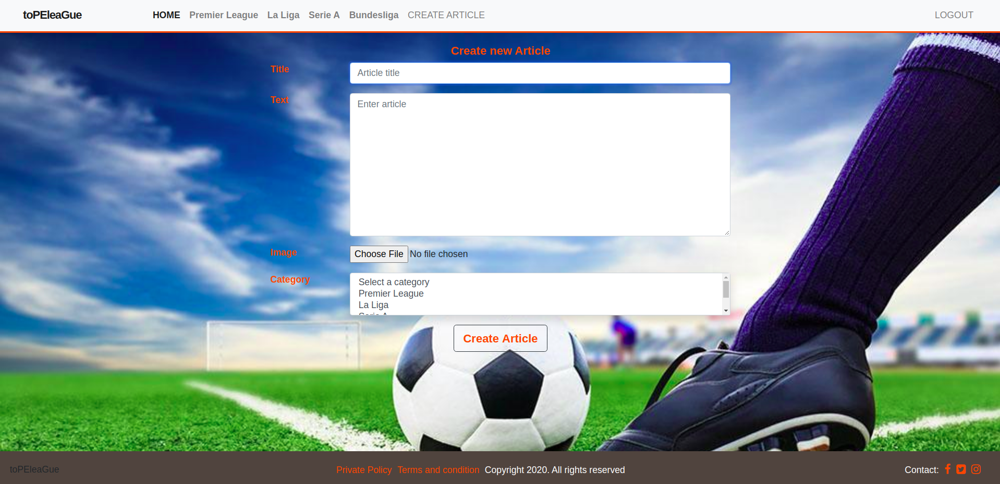
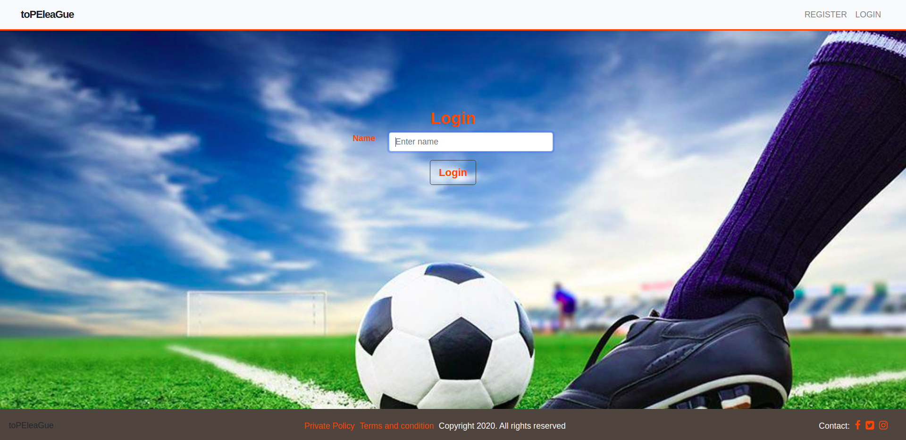

# TopeLeague

toPEleague is a football blog app where you get to write articles on the top four leagues in Europe which are English Premier League, La Liga, Seria A, and Bundesliga. The home page shows all the articles and the top part of the page feature the article with the highest votes. Each article when clicked comprises a "read more" link as well as an option where users can upvote or downvote any article as they so wish.


<!-- PROJECT LOGO -->
<br />
<p align="center">
  <a href="https://github.com/jstloyal/TopLeague-articles">
    
  </a>

  <h3 align="center">RoR Social Media App</h3>

  <p align="center">
    This project is part of the Microverse curriculum in Ruby on Rails module!
    <br />
    <a href="https://github.com/jstloyal/TopLeague-articles"><strong>Explore the docs »</strong></a>
    <br />
    <br />
    <a href="https://github.com/jstloyal/TopLeague-articles/issues">Report Bug</a>
    <a href="https://github.com/jstloyal/TopLeague-articles/issues">Request Feature</a>
  </p>
</p>

<!-- TABLE OF CONTENTS -->

## Table of Contents

- [About the Project](#about-the-project)
- [Contributors](#contributors)
- [Live Version](#live-version)
- [Acknowledgements](#acknowledgements)
- [License](#license)

## features

- An Homepage with the article with the highest category which appear before recent articles based on their categories.
- A all article show page with a read more link and an option where user can vote for their favorite article
- Individual article show page where you get to read more about the article and also see the author name.
- Users authentication is by their names.

## HOMEPAGE

<a href="https://github.com/jstloyal/TopLeague-articles">
  
</a>

## Articles Page

<a href="https://github.com/jstloyal/TopLeague-articles">
  
</a>

## Article View Page

<a href="https://github.com/jstloyal/TopLeague-articles">
  
</a>

## Create New Article Page

<a href="https://github.com/jstloyal/TopLeague-articles">
  
</a>

## Login Page

<a href="https://github.com/jstloyal/TopLeague-articles">
  
</a>

## Live Demo

- [Live Demo](https://mighty-dusk-21959.herokuapp.com/)

## Built With

- Ruby v2.7.0
- Ruby on Rails v5.2.4

## Getting Started

To get a local copy up and running follow these simple example steps.

### Prerequisites

Ruby: 2.6.3
Rails: 5.2.3
Postgres: >=9.5

### Setup

Instal gems with:

```
bundle install
```

Setup database with:

```
   rails db:create
   rails db:migrate
```

### Usage

Start server with:

```
    rails server
```

Open `http://localhost:3000/` in your browser.

### Run tests

```
    rpsec --format documentation
```

### Deployment

TBA

## Author

## Adetayo Sunkanmi

- Github: [@jstloyal](https://github.com/jstloyal)
- Twitter: [@jstloyalty](https://twitter.com/jstloyalty)
- Linkedin: [Adetayo Sunkanmi](https://www.linkedin.com/in/jstloyalty)
- E-mail: jstloyalty@gmail.com

## 🤝 Contributing

Contributions, issues and feature requests are welcome!

Feel free to check the [issues page](issues/).

## Show your support

Give a ⭐️ if you like this project!

## Acknowledgments

- [Microverse](https://www.microverse.org/)
- [Rails Documentation](https://guides.rubyonrails.org/)

## 📝 License

This project is [MIT](https://opensource.org/licenses/MIT) licensed.
